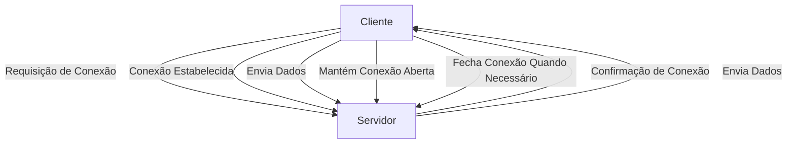

---
tags:
  - Artigos
---
WebSockets são um protocolo de comunicação bidirecional em tempo real, projetado para ser usado em aplicações web. Ao contrário de requisições HTTP, que são baseadas em um modelo de comunicação "request-response" (cliente faz uma requisição e o servidor responde), o WebSocket permite uma conexão contínua, onde tanto o cliente quanto o servidor podem enviar e receber dados a qualquer momento.

Aqui está uma visão geral de como os WebSockets funcionam:

### Características principais dos WebSockets:
1. **Conexão contínua**: Uma vez estabelecida, a conexão WebSocket permanece aberta, permitindo comunicação contínua entre cliente e servidor sem a necessidade de novas requisições HTTP.
2. **Baixa latência**: Como a conexão é persistente, os dados podem ser trocados de forma muito rápida e eficiente, tornando o WebSocket ideal para aplicações que exigem baixa latência, como jogos online, chats, e sistemas de monitoramento em tempo real.
3. **Full-duplex**: O WebSocket suporta comunicação full-duplex, o que significa que tanto o cliente quanto o servidor podem enviar mensagens simultaneamente.
4. **Redução de overhead**: Diferente do HTTP, o WebSocket reduz o overhead de cabeçalhos nas mensagens trocadas, permitindo uma troca de dados mais eficiente.

### Fluxo de funcionamento:
1. **Handshake inicial**: A comunicação WebSocket começa com um "handshake" HTTP, onde o cliente solicita ao servidor a atualização da conexão para WebSocket.
2. **Conexão estabelecida**: Se o servidor aceitar, ele retorna um cabeçalho especial que confirma o início da comunicação WebSocket. Nesse ponto, a conexão é mantida aberta.
3. **Troca de dados**: Cliente e servidor trocam dados diretamente sobre a mesma conexão, sem a necessidade de novas requisições.
4. **Fechamento**: A conexão pode ser fechada a qualquer momento pelo cliente ou servidor.

### Exemplo de uso:
- **Aplicações de chat em tempo real**: Um cliente pode enviar uma mensagem para o servidor, e todos os outros clientes conectados recebem essa mensagem em tempo real.
- **Streaming de dados**: Aplicações que monitoram dados em tempo real, como preços de ações ou resultados de jogos, podem usar WebSockets para enviar atualizações contínuas aos usuários.

Esse protocolo é amplamente utilizado em sistemas que necessitam de atualizações constantes sem o uso excessivo de requisições HTTP, como chats, jogos online, dashboards de monitoramento, entre outros.