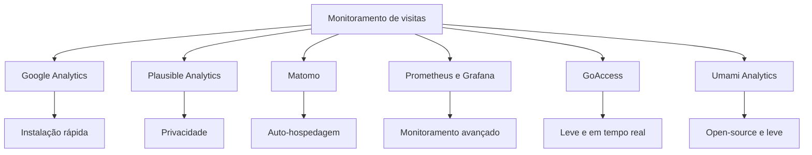

Uma forma eficaz de monitorar as visitas de um site open-source é utilizando ferramentas de analytics e de monitoramento de logs. Aqui estão algumas abordagens que você pode considerar:

### 1. **Google Analytics**
   - **O que é:** Uma das ferramentas mais populares para monitorar o tráfego do site, onde você pode rastrear visitantes, comportamento e fontes de tráfego.
   - **Como usar:**
     - Crie uma conta no [Google Analytics](https://analytics.google.com/).
     - Adicione o código de rastreamento ao seu site (normalmente incluído no cabeçalho ou rodapé).
   - **Prós:** Interface simples, muitas opções de relatórios detalhados.
   - **Contras:** Serviços de terceiros e coleta de dados que podem gerar preocupações com a privacidade.

### 2. **Plausible Analytics**
   - **O que é:** Uma alternativa de analytics mais focada em privacidade e com código open-source.
   - **Como usar:** 
     - Hospede você mesmo ou use a versão SaaS do [Plausible Analytics](https://plausible.io/).
     - Inclua o script de monitoramento no seu site.
   - **Prós:** Foco em privacidade, sem coleta de dados pessoais, interface simplificada.
   - **Contras:** Pode precisar de mais configuração se for self-hosted.

### 3. **Matomo**
   - **O que é:** Outra ferramenta de analytics de código aberto que pode ser auto-hospedada.
   - **Como usar:**
     - Faça o download do [Matomo](https://matomo.org/).
     - Instale-o no seu servidor e adicione o código de rastreamento ao seu site.
   - **Prós:** Controla totalmente os dados, ideal para projetos com grandes volumes de dados.
   - **Contras:** Requer mais recursos e conhecimento de servidor.

### 4. **Monitoramento de Logs do Servidor com Prometheus e Grafana**
   - **O que é:** Se você já utiliza Prometheus e Grafana no seu site, pode configurar o monitoramento dos logs de acesso do servidor para analisar visitas.
   - **Como usar:**
     - Configure o **Prometheus** para coletar métricas dos logs do servidor web (Apache ou Nginx, por exemplo).
     - Integre com o **Grafana** para visualizar os gráficos e relatórios de tráfego em tempo real.
   - **Prós:** Total controle sobre os dados, flexibilidade para monitorar outras métricas além de visitas.
   - **Contras:** Configuração mais avançada e demanda de recursos.

### 5. **GoAccess**
   - **O que é:** Um visualizador de logs de acesso em tempo real para servidores web, com uma interface interativa e de fácil uso.
   - **Como usar:**
     - Instale o [GoAccess](https://goaccess.io/).
     - Aponte-o para os arquivos de log do seu servidor web (ex.: Nginx ou Apache).
   - **Prós:** Simples, rápido, e pode ser usado diretamente no terminal ou com uma interface web.
   - **Contras:** Focado apenas em logs de servidor, sem métricas detalhadas de visitantes.

### 6. **Umami Analytics**
   - **O que é:** Outra opção open-source, leve e focada na privacidade.
   - **Como usar:**
     - Hospede o [Umami Analytics](https://umami.is/).
     - Adicione o script de rastreamento ao seu site.
   - **Prós:** Leve, fácil de configurar e respeita a privacidade.
   - **Contras:** Pode ter menos funcionalidades avançadas que ferramentas maiores.

### Comparativo visual das abordagens:

Cada solução oferece vantagens específicas, e a escolha depende das suas necessidades, como nível de controle sobre os dados, privacidade e profundidade das métricas.

Para um projeto open-source, soluções como **Plausible**, **GoAccess** ou **Umami** podem ser ideais devido ao foco na privacidade e no controle de dados.