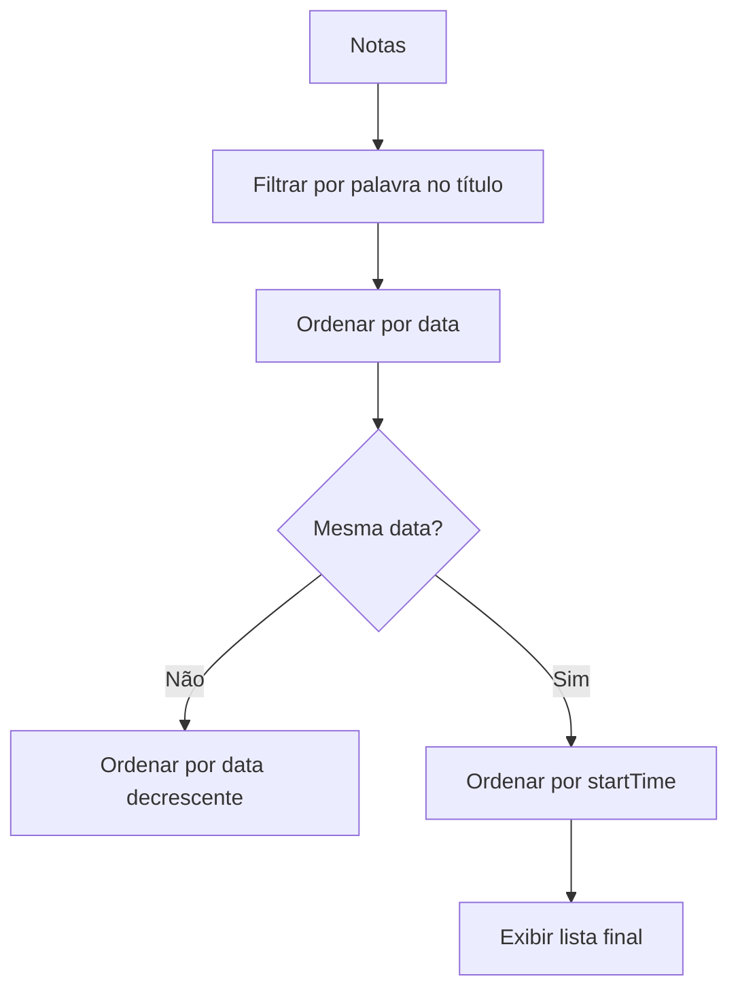

---
tags:
  - Obsidian/Plugin
---

# Conceitos Basicos do plugin

O plugin **Dataview** do #Obsidian permite criar visualizações dinâmicas de informações a partir de notas com base em consultas semelhantes ao SQL. É ideal para organizar e filtrar dados armazenados em tags, cabeçalhos, propriedades frontmatter e até mesmo conteúdo de tabelas em suas notas. Aqui estão alguns comandos básicos para iniciar com o Dataview:

### 1. **Configurar a estrutura da nota com Frontmatter**

Adicione um bloco `YAML frontmatter` no início de cada nota para definir metadados. Isso é essencial para que o Dataview identifique os campos e filtre as notas com base neles.

```yaml
---
title: "Título da Nota"
date: "2024-10-25"
tags: [projeto, desenvolvimento]
status: "Em andamento"
---
```
### 2. **Criar uma Consulta Básica**

O comando básico `table` exibe os dados em uma tabela. Exemplo para listar notas com a tag `projeto`:

```
table title, date, status
from "caminho/da/pasta"
where contains(tags, "projeto")
sort date desc
```

### 3. **Consultar usando `list` e `task`**

- **Lista**: Retorna itens como uma lista, útil para resumos rápidos.

```
list from "caminho/da/pasta"
where status = "Concluído
```

- **Tarefas**: Exibe caixas de tarefas em um projeto ou lista de notas.

```
task from "caminho/da/pasta"
where contains(tags, "tarefa") and status != "Concluído"
```

### 4. **Funções e Cálculos**

É possível fazer cálculos básicos, como contar quantas notas possuem um determinado status:

```
table count(status) as "Total"
from "caminho/da/pasta"
where status = "Em andamento"
```

Esses exemplos iniciais cobrem o uso básico do Dataview no Obsidian


---

# Consulta no Dataview do Obsidian com Filtros e Ordenação

## Filtro por palavra no título
Para criar uma lista de notas que contenham uma palavra específica no título, utilize a seguinte consulta no Dataview:

```
list
from ""
where contains(file.name, "palavra_especifica")
```

- **`from ""`**: Busca as notas em todas as pastas.
- **`contains(file.name, "palavra_especifica")`**: Filtra as notas onde o nome do arquivo contém a palavra que você especificar.

### Exemplo
Para listar todas as notas cujo título contenha a palavra "projeto":

```
list
from ""
where contains(file.name, "projeto")
```

## Ordenação por data
Se você quiser ordenar suas notas por uma propriedade de data que você criou, como `date`, basta adicionar o campo de ordenação:

```
list
from ""
where contains(file.name, "palavra_especifica")
sort date desc
```

- **`sort date desc`**: Ordena pela sua propriedade personalizada `date`, em ordem decrescente (mais recente primeiro).

Se preferir uma ordenação crescente:

```
list
from ""
where contains(file.name, "palavra_especifica")
sort date asc
```

## Ordenação por hora (startTime)
Caso você tenha uma propriedade `startTime` que inclua a hora, e deseje utilizá-la para ordenação, basta substituir `date` por `startTime`:

```
list
from ""
where contains(file.name, "palavra_especifica")
sort startTime desc
```

- **`sort startTime desc`**: Ordena pela propriedade `startTime`, da mais recente para a mais antiga.

## Ordenação combinada: `date` e `startTime`
Se você quiser ordenar suas notas primeiro por `date` e, em seguida, por `startTime` (caso várias notas tenham a mesma data), utilize a consulta abaixo:

```
list
from ""
where contains(file.name, "palavra_especifica")
sort date desc, startTime desc
```

- **`sort date desc, startTime desc`**: Ordena pela `date` em ordem decrescente e, se houver notas com a mesma data, ordena pela `startTime`.

### Visualização do Processo com Mermaid
Aqui está uma visualização do fluxo de ordenação usando o **Mermaid** para mostrar como o processo ocorre:



### Explicação:
1. **Filtragem inicial**: As notas são filtradas para conter uma palavra específica no título.
2. **Primeira ordenação**: Ordena-se todas as notas pela propriedade `date` (por data).
3. **Segunda verificação**: Caso haja notas com a mesma data, entra a segunda ordenação.
4. **Segunda ordenação**: As notas com a mesma data são ordenadas por `startTime`.


