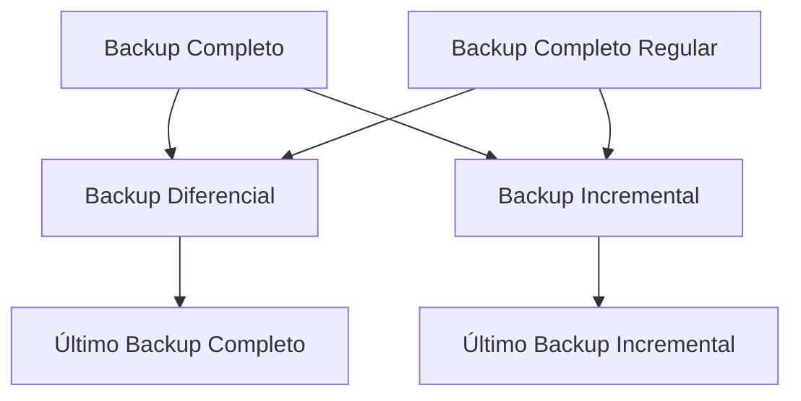

---
tags:
  - TI/Tecnologia/DBA
---
Fazer backup de um banco de dados é essencial para garantir que seus dados estejam seguros e disponíveis em caso de falhas ou problemas. Abaixo, estão algumas maneiras de realizar backups em diferentes tipos de banco de dados, além de estratégias de backup comuns:

---

## Estratégias de Backup

### 1. **Backup Completo (Full Backup)**
Um **backup completo** captura todos os dados do banco de dados, gerando uma cópia integral. É a forma mais simples, mas pode consumir muito tempo e espaço de armazenamento.

### 2. **Backup Incremental**
O **backup incremental** armazena apenas as mudanças feitas no banco de dados desde o último backup (completo ou incremental). Ele é mais rápido e consome menos espaço, mas a recuperação pode ser mais lenta, já que você precisará combinar múltiplos backups para restaurar os dados.

### 3. **Backup Diferencial**
Um **backup diferencial** copia apenas os dados que mudaram desde o último backup completo. Ele ocupa mais espaço que o incremental, mas é mais rápido para restaurar, pois você só precisa do backup completo mais o último backup diferencial.

---

## Backup em Diferentes Bancos de Dados

### 1. **MySQL**
#TI/Tecnologia/DBA/MySQL 
#### a) Usando `mysqldump`
O `mysqldump` é uma ferramenta embutida no [[MySQL]] para gerar backups de bancos de dados:

```bash
mysqldump -u usuario -p senha nome_do_banco > backup_banco.sql
```

Para fazer o backup de todos os bancos de dados:

```bash
mysqldump -u usuario -p senha --all-databases > backup_todos_bancos.sql
```

#### b) Backup Incremental usando binlogs
Se você tem binlogs habilitados no MySQL, pode fazer backups incrementais:

1. Faça um **backup completo** com `mysqldump`.
2. Faça backup dos **binlogs** (arquivos que contêm mudanças incrementais):

```bash
mysqlbinlog binlog.000001 > backup_binlog.sql
```

### 2. **PostgreSQL**
#### a) Usando `pg_dump`
O `pg_dump` gera um backup de um único banco de dados [[PostgreSQL]]:

```bash
pg_dump -U usuario nome_do_banco > backup_banco.sql
```

Para fazer backup de todos os bancos de dados:

```bash
pg_dumpall -U usuario > backup_todos_bancos.sql
```

#### b) Backup Incremental com `PITR` (Point-In-Time Recovery)
PostgreSQL permite backups incrementais usando arquivos WAL (Write-Ahead Logging). Para isso:
1. Habilite os arquivos WAL.
2. Faça backups regulares dos arquivos WAL junto com os backups completos.

### 3. **MongoDB**
#### a) Usando `mongodump`
Para [[MongoDB]], você pode usar `mongodump` para fazer um dump (exportação) dos dados:

```bash
mongodump --db nome_do_banco --out /caminho/do/backup
```

Isso irá gerar o backup do banco de dados em formato BSON (formato binário do JSON).

### 4. **Microsoft SQL Server**
#### a) Usando `sqlcmd` ou via Management Studio
Você pode fazer backup no SQL Server com `sqlcmd`:

```sql
BACKUP DATABASE nome_do_banco TO DISK = 'C:\backup_banco.bak'
```

No SQL Server Management Studio, você pode usar a interface gráfica para criar backups completos, diferenciais ou incrementais.

---

## Automatização e Agendamento de Backups

Para evitar fazer backups manuais, você pode usar ferramentas de agendamento:

- **Linux**: Usar cron jobs para agendar backups periódicos (diários, semanais etc.).
- **Windows**: Usar o Agendador de Tarefas para configurar backups automáticos.
- **Docker**: Caso o banco de dados esteja em containers, você pode usar o `docker exec` junto com scripts de backup.

Exemplo com [[cron]] no Linux:

```bash
0 2 * * * /usr/bin/mysqldump -u usuario -p senha nome_do_banco > /backup/caminho/backup_banco.sql
```

Isso realiza um backup diário às 2h da manhã.

---

### Visualização de Estratégias



---

Essas são as maneiras mais comuns e eficazes de fazer backups de bancos de dados, sempre adaptadas ao seu cenário.