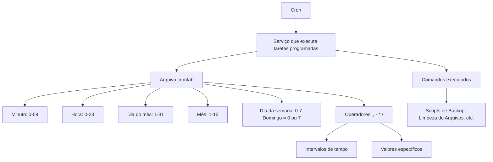

O `Cron` é um serviço em sistemas Linux que executa tarefas agendadas automaticamente em horários ou intervalos pré-determinados. Ele é muito utilizado para automação de manutenção, backups, limpeza de arquivos, execução de scripts, entre outros. As tarefas são especificadas em um arquivo chamado **crontab**.

### Estrutura da Crontab

As linhas no arquivo crontab têm cinco campos que especificam quando uma tarefa deve ser executada, seguidos do comando a ser executado:

```bash
*  *  *  *  * /caminho/para/o/comando
-  -  -  -  -
|  |  |  |  |
|  |  |  |  +---- Dia da semana (0-7) (0 ou 7 = domingo)
|  |  |  +------- Mês (1-12)
|  |  +---------- Dia do mês (1-31)
|  +------------- Hora (0-23)
+---------------- Minuto (0-59)
```

Cada campo pode conter:
- Um número inteiro para um valor específico.
- Um intervalo, por exemplo, `2-5` para representar um intervalo de valores.
- Uma vírgula para listar valores, como `1,3,5`.
- Um asterisco (`*`) que indica "qualquer valor".

#### Exemplo de crontab:
```bash
30 2 * * * /usr/bin/backup.sh
```
Isso significa que o script `backup.sh` será executado **todos os dias às 2h30 da manhã**.

### Comandos úteis:

- **Editar crontab**: Para adicionar ou editar tarefas, usa-se o comando:
  ```bash
  crontab -e
  ```
- **Ver crontabs**: Para listar as tarefas agendadas do usuário:
  ```bash
  crontab -l
  ```
- **Remover crontab**: Para remover todas as tarefas agendadas:
  ```bash
  crontab -r
  ```

### Mapa Mental do Cron:



### Operadores úteis em cron:
- `,`: para separar valores distintos (ex: `1,15` para o dia 1 e 15 do mês).
- `-`: para intervalos (ex: `2-5` para os dias de 2 a 5).
- `*`: qualquer valor (ex: `*` para "todos os dias").
- `/`: intervalos de repetição (ex: `*/2` para "a cada 2 minutos").

Essa estrutura torna o cron extremamente flexível para agendamento de tarefas, permitindo desde execuções simples até configurações avançadas com intervalos específicos.

### Referências:
- https://man7.org/linux/man-pages/man5/crontab.5.html
- https://opensource.com/article/17/11/how-use-cron-linux