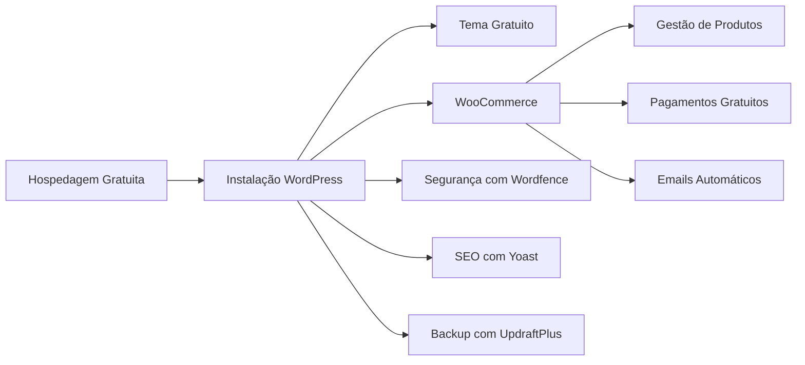

Um projeto de e-commerce gratuito utilizando WordPress pode ser realizado com foco em ferramentas, temas e plugins sem custo. Abaixo está um escopo básico para configurar uma loja online funcional de forma 100% gratuita:

### 1. **Instalação do WordPress**
   - **Hospedagem gratuita**: Use serviços de hospedagem gratuitos (como InfinityFree, 000WebHost, etc.). Lembre-se de que eles têm limitações em termos de recursos, como espaço em disco e velocidade.
   - **Domínio gratuito**: Utilize domínios gratuitos como `.tk`, `.ml` (disponíveis no Freenom), ou subdomínios fornecidos pela hospedagem gratuita.
   - **Instalação do WordPress**: Muitas dessas hospedagens oferecem instaladores automáticos de WordPress.

### 2. **Tema Gratuito para E-commerce**
   - **Astra**: Um tema leve e personalizável, gratuito e compatível com WooCommerce.
   - **Storefront**: Tema oficial do WooCommerce, projetado especificamente para e-commerce, fácil de customizar.

### 3. **Plugin de E-commerce**
   - **WooCommerce**: Plugin gratuito mais popular para transformar seu WordPress em uma loja virtual completa. Ele oferece:
     - Carrinho de compras
     - Checkout
     - Opções de pagamento via PayPal e transferência bancária
     - Gestão de produtos, categorias e estoque
     - Relatórios e análises

### 4. **Plugins Gratuitos Adicionais**
   - **WooCommerce Payments**: Para integrar métodos de pagamento locais.
   - **Elementor** (versão gratuita): Para personalizar páginas e criar um design mais atrativo sem precisar saber programar.
   - **Wordfence Security**: Para garantir segurança básica do site.
   - **UpdraftPlus**: Para backup automático do seu site.

### 5. **Funcionalidades Básicas**
   - **Gestão de Produtos**: Adicione produtos, descrições, preços e imagens de maneira simples via WooCommerce.
   - **Categorias e Filtros**: Organize produtos em categorias e subcategorias.
   - **Carrinho e Pagamentos**: Habilite os sistemas de pagamento oferecidos gratuitamente (PayPal, transferência bancária).
   - **Entrega**: Configure zonas de envio e taxas de acordo com as regiões atendidas.
   - **Emails Transacionais**: Configure os e-mails automáticos de confirmação de pedido e envio.

### 6. **SEO e Performance**
   - **Yoast SEO**: Plugin gratuito para melhorar o SEO do site.
   - **Autoptimize**: Para otimização de desempenho, minimizando o carregamento de scripts e estilos.
   - **Smush**: Plugin gratuito para compressão de imagens.

### 7. **Design e Experiência do Usuário**
   - **Imagens e Vídeos**: Utilize bancos de imagens gratuitos (Pexels, Unsplash) para fotos de produtos.
   - **Design Responsivo**: Teste a responsividade no mobile e desktop com ferramentas gratuitas como o Google Mobile-Friendly Test.

### 8. **Marketing e Engajamento**
   - **Mailchimp for WooCommerce**: Para capturar e-mails de clientes e enviar newsletters (integração gratuita).
   - **OneSignal**: Notificações push gratuitas para atrair visitantes de volta ao site.
   - **Google Analytics for WordPress** (MonsterInsights versão gratuita): Para monitorar o tráfego e analisar o comportamento do usuário.

### 9. **Testes e Lançamento**
   - **Testes de Pagamento**: Verifique se todas as etapas de pagamento e envio estão funcionando corretamente.
   - **Teste de Desempenho**: Use ferramentas como GTmetrix para verificar a velocidade do site.
   - **Lançamento**: Certifique-se de que todos os produtos estão cadastrados corretamente e que o fluxo de compra está funcional.

### 10. **Expansão Futura**
   - Após o crescimento inicial, considere investir em upgrades pagos, como melhores hospedagens ou plugins premium, para melhorar a performance e as funcionalidades da loja.

### Exemplo de Diagrama

Este escopo cobre a criação de uma loja online funcional sem custos adicionais, ideal para quem está começando e deseja uma solução acessível.