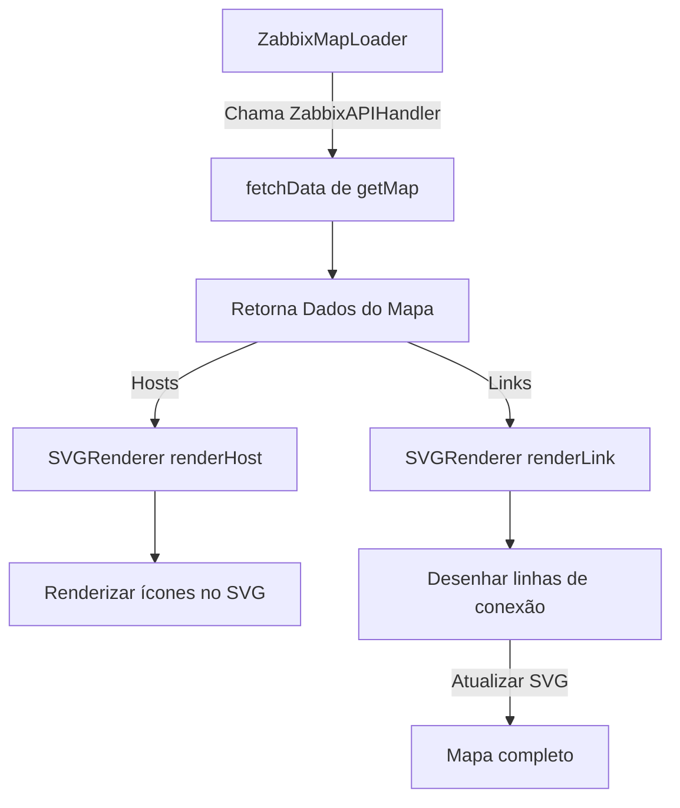

[[2109 - Mapa da rede Datacenter + Bases|Link do projeto]]

> [!NOTE]
> Pedido melhorias ao #AI/GPT e foras essas melhorias que ele propros

### Melhorias Propostas:

1. **Separação de Preocupações:**
    
    - Dividir a classe `Zabbix_Interpretador` em várias funções menores e modulares para melhorar a manutenção e testes.
    - Criar um gerenciador de dados que lide exclusivamente com as chamadas de API do Zabbix.
2. **Carregamento de Imagens:**
    
    - Implementar uma função para cacheamento das imagens baixadas para não sobrecarregar o servidor.
    - Adicionar tratamento de erro ao carregar as imagens dos ícones dos hosts.
3. **Otimização do Desenho de Linhas:**
    
    - Melhorar a lógica de cálculo das curvas Bézier para criar transições mais suaves entre hosts distantes e minimizar o tempo de renderização.
    - Introduzir um sistema de zoom para grandes mapas, aproveitando a manipulação de `viewBox` do SVG.
4. **Adição de Interatividade:**
    
    - Tornar os elementos clicáveis, permitindo ações como exibir mais detalhes sobre o host ou a conexão (tooltip, modal, etc.).
    - Adicionar animações às conexões de linha para destacar o tráfego de rede ou status dinâmico.

### Melhorias Visuais (Mermaid)

Para organizar a lógica de fluxo, podemos utilizar o diagrama de atividades em **Mermaid**, ilustrando a sequência de execução no carregamento dos mapas:

Com essas modificações, o código fica mais modular, escalável e pronto para futuras expansões, como zoom, interatividade e monitoramento em tempo real.

### Código

```html
<script>
    class Zabbix_Interpretador {
        apiUrl = "http://monitor.netturbosolucoes.com.br:8989/api_jsonrpc.php";  
        authToken = "c6dbe55c40c8ae2c057ce64957d9d3452702b80dda302893b4dd2889f949642d";  
        SVGInstance;  
        IMGContent = {};  
        imagensCarregadas = 0;
        totalImagens = 0;

        InicializarSVG() {
            this.SVGInstance = document.getElementById('Mapa_NTT');  
            this.SVGInstance.innerHTML = "";  
            this.SVGInstance.setAttribute('viewBox', "0 0 1920 1080");

            const linesGroup = document.createElementNS("http://www.w3.org/2000/svg", "g");
            linesGroup.setAttribute("id", "linesGroup");  
            this.SVGInstance.appendChild(linesGroup);  

            const imagesGroup = document.createElementNS("http://www.w3.org/2000/svg", "g");
            imagesGroup.setAttribute("id", "imagesGroup");  
            this.SVGInstance.appendChild(imagesGroup);  
        }

        CarregarHosts(ListaHosts) {
            const imagesGroup = document.getElementById("imagesGroup");  
            this.totalImagens = ListaHosts.length; // Total de hosts a serem carregados

            ListaHosts.forEach(element => {
                let imgElement = document.createElementNS("http://www.w3.org/2000/svg", 'image');
                imgElement.setAttributeNS("http://www.w3.org/1999/xlink", 'href', 'http://monitor.netturbosolucoes.com.br:8989/imgstore.php?iconid=' + element.iconid_off);  
                imgElement.setAttribute("x", element.x);  
                imgElement.setAttribute("y", element.y);  

                imgElement.onload = () => {
                    let bbox = imgElement.getBBox();
                    this.IMGContent[element.selementid] = {
                        width: bbox.width,
                        height: bbox.height,
                        centerX: parseInt(element.x) + bbox.width / 2,  
                        centerY: parseInt(element.y) + bbox.height / 2  
                    };

                    let textElement = document.createElementNS("http://www.w3.org/2000/svg", 'text');
                    textElement.setAttribute("x", this.IMGContent[element.selementid].centerX);  
                    textElement.setAttribute("y", parseInt(element.y) + bbox.height + 20);  
                    textElement.setAttribute("fill", "white");  
                    textElement.setAttribute("font-size", "16");  
                    textElement.setAttribute("font-family", "Arial");  
                    textElement.setAttribute("text-anchor", "middle");  
                    textElement.textContent = element.label;  

                    imagesGroup.appendChild(textElement);

                    this.imagensCarregadas++;  
                    if (this.imagensCarregadas === this.totalImagens) {  
                        // Quando todas as imagens forem carregadas, chamamos a função para carregar as linhas
                        this.CarregarLinhas(window.ListaLinks);  
                    }
                };

                this.SVGInstance.appendChild(imgElement);
            });
        }

        async CarregarLinhas(ListaLinks) {
            const linesGroup = document.getElementById("linesGroup");  

            for (const link of ListaLinks) {
                let origem = this.IMGContent[link.selementid1];  
                let destino = this.IMGContent[link.selementid2];  

                if (origem && destino) {
                    let triggers = await this.ObterTriggers(link.selementid1, link.selementid2);

                    let cor = "white";  

                    if (triggers.some(trigger => trigger.value == 1)) {
                        cor = 'red';  
                    } else if (link.color) {
                        cor = `#${link.color}`;  
                    }

                    let deltaX = Math.abs(destino.centerX - origem.centerX);
                    let deltaY = Math.abs(destino.centerY - origem.centerY);

                    let pathData;
                    if (deltaX > 50 && deltaY > 50) {  
                        let controle1X = origem.centerX + (destino.centerX - origem.centerX) / 4;
                        let controle1Y = origem.centerY - 50;  

                        let controle2X = origem.centerX + (destino.centerX - origem.centerX) * (3 / 4);
                        let controle2Y = destino.centerY + 50;  

                        pathData = `M ${origem.centerX},${origem.centerY} C ${controle1X},${controle1Y} ${controle2X},${controle2Y} ${destino.centerX},${destino.centerY}`;
                    } else {  
                        pathData = `M ${origem.centerX},${origem.centerY} L ${destino.centerX},${destino.centerY}`;
                    }

                    let pathElement = document.createElementNS("http://www.w3.org/2000/svg", 'path');
                    pathElement.setAttribute("d", pathData);  
                    pathElement.setAttribute("stroke", cor);  
                    pathElement.setAttribute("stroke-width", "2");  
                    pathElement.setAttribute("fill", "none");  

                    linesGroup.appendChild(pathElement);
                } else {
                    console.warn(`Host de origem ou destino não encontrado para o link entre ${link.selementid1} e ${link.selementid2}`);
                }
            }
        }

        async ObterTriggers(hostid1, hostid2) {
            const response = await fetch(this.apiUrl, {
                method: 'POST',
                mode: "cors",
                headers: {
                    'Content-Type': 'application/json-rpc',
                },
                body: JSON.stringify({
                    jsonrpc: "2.0",
                    method: "trigger.get",
                    params: {
                        "output": ["triggerid", "description", "priority", "value"],  
                        "hostids": [hostid1, hostid2],  
                        "filter": {
                            "value": 1  
                        }
                    },
                    auth: this.authToken,
                    id: 1
                })
            });

            const data = await response.json();  
            return data.result;  
        }

        CarregarMapa(mapaId) {
            fetch(this.apiUrl, {
                method: 'POST',
                mode: "cors",
                headers: {
                    'Content-Type': 'application/json-rpc',
                },
                body: JSON.stringify({
                    jsonrpc: "2.0",
                    method: "map.get",
                    params: {
                        "output": ["selements", "links"],
                        "selectSelements": ["selementid", "label", "iconid_off", "x", "y"],  
                        "selectLinks": ["selementid1", "selementid2", "color"],  
                        "sysmapids": mapaId  
                    },
                    auth: this.authToken,
                    id: 1
                })
            }).then(response => response.json())  
            .then(data => {
                this.InicializarSVG();

                window.ListaLinks = data.result[0].links;  // Armazenar links em uma variável global temporária
                this.CarregarHosts(data.result[0].selements);  // Agora chamamos o carregamento das hosts, e as linhas só são desenhadas após carregar todas as imagens
            }).catch(error => {
                console.error("Erro ao carregar o mapa: ", error);
            });
        }
    }

    let interpretador = new Zabbix_Interpretador();  
    interpretador.CarregarMapa(3);  
</script>


```