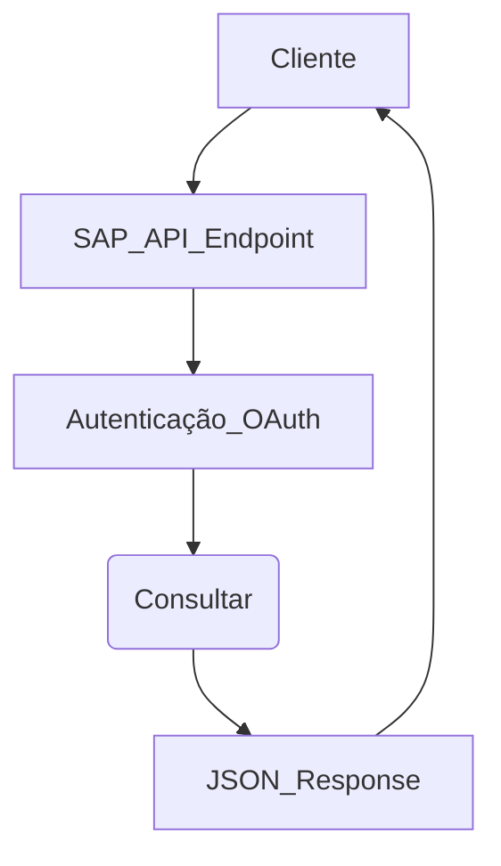
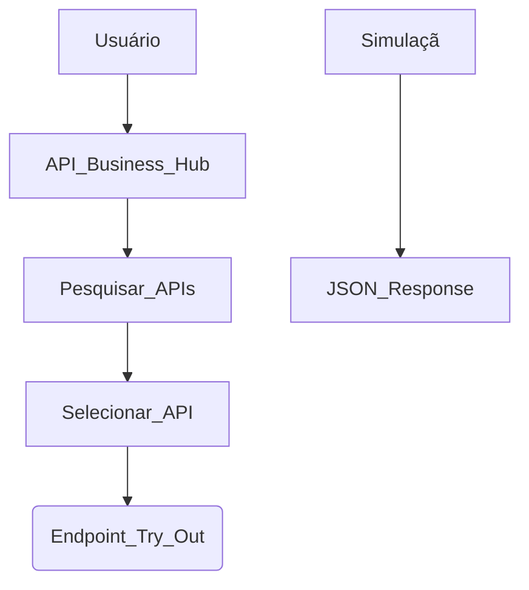

---
tags:
  - Trabalho/NetTurbo/SAP
  - Artigos
---
A API do SAP (Systems, Applications, and Products) refere-se ao conjunto de interfaces que permitem a interação programática com os sistemas SAP, como o **SAP ERP**, **SAP S/4HANA**, **SAP Business One**, entre outros. Essas APIs são essenciais para integrar o SAP com outras aplicações ou para permitir a automação de processos dentro de uma empresa.

Existem diferentes tipos de APIs no SAP, dependendo da tecnologia ou do sistema envolvido. Aqui estão os principais tipos de APIs que você pode encontrar:

### 1. **OData (Open Data Protocol) APIs**
   OData é um protocolo amplamente usado no SAP, especialmente em soluções como o SAP S/4HANA. Ele permite que dados estruturados sejam acessados e manipulados via chamadas HTTP. Os principais benefícios incluem:
   - Utilização de padrões RESTful.
   - Compatível com muitos clientes (web, mobile, etc.).
   - Facilita a manipulação de dados no formato JSON ou XML.

   Exemplos de uso:
   - Acesso a dados mestres como clientes, fornecedores e produtos.
   - Execução de operações CRUD (Create, Read, Update, Delete) sobre entidades do SAP.

### 2. **SOAP APIs (Simple Object Access Protocol)**
   As APIs baseadas em SOAP são amplamente utilizadas em soluções SAP mais tradicionais, como o **SAP ECC** e alguns serviços do **SAP NetWeaver**. O SOAP é um protocolo baseado em XML que define uma estrutura para troca de informações entre sistemas.
   
   Características:
   - Orientado a mensagens XML.
   - Suporte robusto para transações e segurança.
   - Comumente usado em cenários empresariais complexos.

   Exemplos de uso:
   - Integrações com sistemas legados ou de terceiros que também utilizam SOAP.
   - Operações mais complexas que requerem transações seguras e confiáveis.

### 3. **SAP Cloud Platform APIs**
   A **SAP Cloud Platform** oferece um conjunto de APIs que permitem estender e integrar aplicativos no ecossistema SAP Cloud. As APIs disponíveis na SAP Cloud Platform abrangem vários domínios, como:
   - Integração com soluções de IoT.
   - Extensões de processos empresariais.
   - Integração com SAP Fiori para criar interfaces de usuário personalizadas.

   Exemplos:
   - Criar uma extensão customizada para processos de aprovação de faturas.
   - Usar APIs de autenticação para integrar com outros sistemas de identidade.

### 4. **RFC (Remote Function Call)**
   O **RFC** é um protocolo exclusivo da SAP para comunicação entre sistemas SAP. Ele permite a execução remota de funções no SAP ERP. Esta tecnologia é usada tanto para integrações internas dentro de uma paisagem SAP quanto para integrações externas.
   
   Exemplos de uso:
   - Integração direta com módulos do SAP para manipular dados de uma maneira otimizada.
   - Criação de interfaces de terceiros que precisam interagir com o SAP sem REST ou SOAP.

### 5. **BAPIs (Business Application Programming Interfaces)**
   As **BAPIs** são um tipo específico de interface que utiliza o RFC para chamar funções no sistema SAP. Elas expõem transações de negócios e dados do sistema SAP para outros sistemas, permitindo a integração com ferramentas externas.

   Exemplo:
   - Integrar sistemas externos que criam, modificam ou consultam dados de transações SAP, como ordens de venda, materiais ou inventário.

### 6. **Event-Driven APIs e Webhooks**
   O SAP também oferece suporte para **event-driven APIs**, onde eventos específicos do sistema SAP podem acionar ações externas, geralmente através do uso de **webhooks**. Isso é particularmente útil para notificar sistemas externos quando certas ações ocorrem no SAP.

   Exemplos:
   - Enviar uma notificação para um sistema de logística externo quando uma ordem de venda é criada no SAP.
   - Disparar eventos baseados em ações de workflow dentro do SAP.

---

### Como acessar a API do SAP?

#### **SAP API Business Hub**
A maioria dessas APIs pode ser encontrada no **SAP API Business Hub** (https://api.sap.com/), uma plataforma centralizada onde você pode explorar, testar e integrar APIs SAP. O SAP API Business Hub oferece uma ampla gama de APIs, com documentações detalhadas e opções para testar as chamadas diretamente.

#### **Autenticação e Autorização**
A segurança é um aspecto essencial ao utilizar as APIs do SAP. Dependendo do tipo de API, você terá que lidar com diferentes mecanismos de autenticação, como:
   - **OAuth 2.0** para APIs modernas baseadas em REST e OData.
   - **Autenticação básica** para APIs SOAP.
   - **Certificados** e **token de autenticação** para garantir comunicações seguras.

### Exemplo de fluxo de interação com uma API OData:

Nesse fluxo:
- O **Cliente** (um aplicativo ou serviço) envia uma requisição ao **SAP API Endpoint** (por exemplo, para buscar dados de clientes).
- A autenticação é feita via **OAuth**, garantindo que o cliente tenha as permissões corretas.
- O endpoint retorna uma **resposta JSON** com os dados solicitados.

### Benefícios das APIs do SAP
- **Integração facilitada** com outros sistemas empresariais.
- **Automação de processos** repetitivos e transacionais.
- **Expansão da funcionalidade do SAP** para soluções específicas da empresa.
- **Melhoria na eficiência** de operações de TI, com menos necessidade de intervenção manual.

Sim! Você pode usar o **SAP API Business Hub** para explorar e fazer simulações de chamadas API gratuitamente. O **SAP API Business Hub** (https://api.sap.com/) oferece uma plataforma onde você pode:

1. **Explorar APIs disponíveis** – Você pode navegar por diversas APIs do ecossistema SAP, incluindo APIs de OData, SOAP, BAPIs e outros serviços do SAP.
   
2. **Testar APIs diretamente** – A plataforma permite que você faça chamadas diretamente do ambiente sem precisar configurar um ambiente SAP completo. As APIs podem ser testadas com dados de exemplo fornecidos pelo próprio SAP.

3. **Documentação e Exemplos** – Cada API é bem documentada, com exemplos de uso e informações detalhadas sobre endpoints, métodos, e parâmetros.

### Passos para simular:
1. Acesse o **SAP API Business Hub**: https://api.sap.com/.
2. Registre-se para uma conta gratuita ou faça login com suas credenciais SAP.
3. Explore as APIs por categorias ou procure uma API específica que deseja testar.
4. Clique em uma API e você verá a documentação completa, além de um botão "Try Out" para simular uma chamada diretamente do navegador.
   
### Recursos adicionais:
- **Sandbox environments** – Algumas APIs possuem ambientes "sandbox" onde você pode fazer testes sem impacto em sistemas reais.
- **Autenticação** – Para testar APIs que exigem autenticação (como OAuth), a própria plataforma guia o processo, facilitando o teste.

### Exemplo visual de como a simulação funciona no SAP API Business Hub:

Essa plataforma é uma ótima maneira de aprender e testar chamadas API do SAP sem custos.